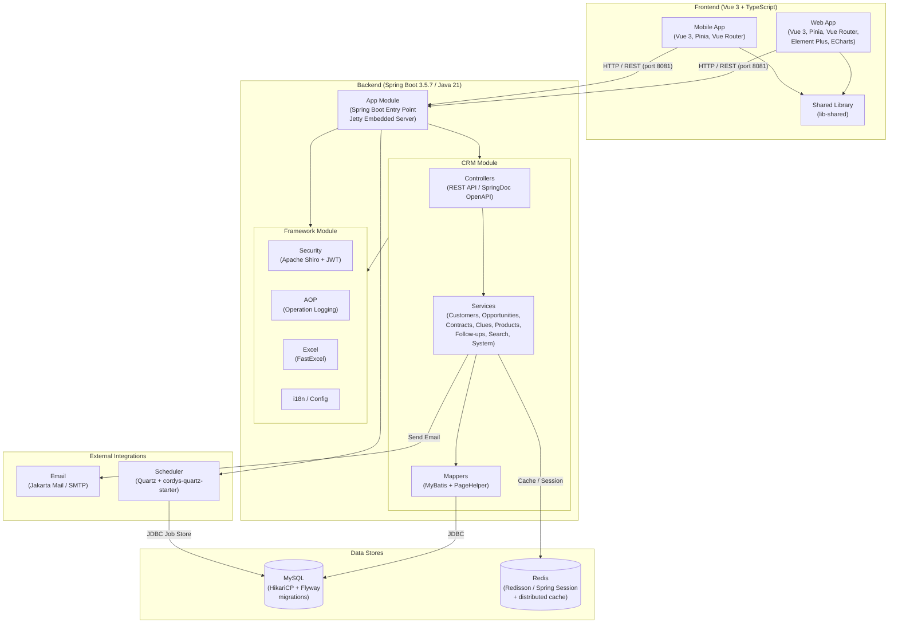

# Architecture Diagram

CordysCRM is a full-stack CRM application built with a Vue 3 frontend and a Spring Boot backend, backed by MySQL and Redis.

## Application Architecture

```mermaid
flowchart TB
    subgraph Frontend["Frontend (Vue 3 + TypeScript)"]
        direction TB
        WEB["Web App\n(Vue 3, Pinia, Vue Router,\nElement Plus, ECharts)"]
        MOBILE["Mobile App\n(Vue 3, Pinia, Vue Router)"]
        SHARED["Shared Library\n(lib-shared)"]
        WEB --> SHARED
        MOBILE --> SHARED
    end

    subgraph Backend["Backend (Spring Boot 3.5.7 / Java 21)"]
        direction TB
        APP["App Module\n(Spring Boot Entry Point\nJetty Embedded Server)"]

        subgraph CRM["CRM Module"]
            direction LR
            CTRL["Controllers\n(REST API / SpringDoc OpenAPI)"]
            SVC["Services\n(Customers, Opportunities,\nContracts, Clues, Products,\nFollow-ups, Search, System)"]
            MAPPER["Mappers\n(MyBatis + PageHelper)"]
            CTRL --> SVC --> MAPPER
        end

        subgraph FW["Framework Module"]
            direction LR
            SEC["Security\n(Apache Shiro + JWT)"]
            AOP["AOP\n(Operation Logging)"]
            EXCEL["Excel\n(FastExcel)"]
            I18N["i18n / Config"]
        end

        APP --> CRM
        APP --> FW
        CRM --> FW
    end

    subgraph DataStores["Data Stores"]
        MySQL[("MySQL\n(HikariCP + Flyway\nmigrations)")]
        Redis[("Redis\n(Redisson / Spring Session\n+ distributed cache)")]
    end

    subgraph Integrations["External Integrations"]
        MAIL["Email\n(Jakarta Mail / SMTP)"]
        QUARTZ["Scheduler\n(Quartz + cordys-quartz-starter)"]
    end

    WEB -- "HTTP / REST (port 8081)" --> APP
    MOBILE -- "HTTP / REST (port 8081)" --> APP
    MAPPER -- "JDBC" --> MySQL
    QUARTZ -- "JDBC Job Store" --> MySQL
    SVC -- "Cache / Session" --> Redis
    SVC -- "Send Email" --> MAIL
    APP --> QUARTZ
```
