# Architecture Diagram

CordysCRM is a Spring Boot 3 multi-module CRM application with a React/Vue-based frontend, backed by MySQL, Redis, and integrations with enterprise collaboration platforms.

## Application Architecture

```mermaid
flowchart TB
    subgraph Clients["Client Layer"]
        WEB["Web App\n(frontend/packages/web)"]
        MOB["Mobile App\n(frontend/packages/mobile)"]
    end

    subgraph Backend["Backend - Spring Boot 3.5.7 / Java 21 / Jetty"]
        subgraph API["API Layer"]
            CTRL["Controllers\n(Customer, Clue, Opportunity,\nContract, Product, Dashboard)"]
            DOC["SpringDoc OpenAPI 2.8\nSwagger UI"]
        end

        subgraph Framework["Framework Layer"]
            SEC["Security\n(Apache Shiro 2.0.4 + JWT)"]
            SESSION["Session Management\n(Spring Session + Redis)"]
            SCHED["Scheduler\n(Quartz, 10 threads)"]
            AUDITLOG["Audit Logging\n(AOP-based operation log)"]
            FILEH["File Handling\n(S3 + Local Storage)"]
            EXCEL["Excel Processing\n(FastExcel 1.3.0)"]
            I18N["i18n / Freemarker\nGroovy Templates"]
        end

        subgraph Business["Business Layer"]
            CRM["CRM Domain Services\n(Customer, Clue, Opportunity,\nContract, Product, Follow-up)"]
            SEARCH["Search Service\n(Global + Advanced)"]
            DASH["Dashboard Service\n(DataEase BI Sync)"]
            SCOPE["Data Scope\n(Role-based access)"]
        end

        subgraph DataAccess["Data Access Layer"]
            MYBATIS["MyBatis 3.0.5\n(Lazy-loading disabled,\nCamelCase mapping)"]
            FLYWAY["Flyway\n(DB Migrations)"]
            PAGEHELPER["PageHelper 6.1.1\n(Pagination)"]
        end
    end

    subgraph Storage["Data Storage"]
        MYSQL["MySQL\n(HikariCP, max 100 conns)"]
        REDIS["Redis\n(Redisson 3.52.0,\n12h session TTL)"]
        FILES["File Storage\n(Local / S3-compatible)"]
    end

    subgraph Integrations["External Integrations"]
        DINGTALK["DingTalk\n(Dept Sync)"]
        WECOM["WeChat Work\n(Dept Sync)"]
        LARK["Lark / ByteDance\n(Dept Sync)"]
        SSO["SSO / OAuth\n(QRCode + Token)"]
        MAIL["Email\n(Jakarta Mail 2.0.3)"]
        SQLBOT["SQL Bot\n(Data Query)"]
        TENDER["Tender API\n(Procurement)"]
    end

    WEB -- "HTTP REST / JSON" --> CTRL
    MOB -- "HTTP REST / JSON" --> CTRL
    CTRL --> SEC
    SEC --> SESSION
    CTRL --> CRM
    CTRL --> SEARCH
    CTRL --> DASH
    CRM --> SCOPE
    CRM --> MYBATIS
    CRM --> FILEH
    CRM --> EXCEL
    CRM --> MAIL
    SCHED --> CRM
    AUDITLOG -.-> CRM
    MYBATIS --> FLYWAY
    MYBATIS --> PAGEHELPER
    MYBATIS --> MYSQL
    SESSION --> REDIS
    CRM --> REDIS
    FILEH --> FILES
    CRM --> DINGTALK
    CRM --> WECOM
    CRM --> LARK
    CRM --> SSO
    DASH --> SQLBOT
    CRM --> TENDER
```

