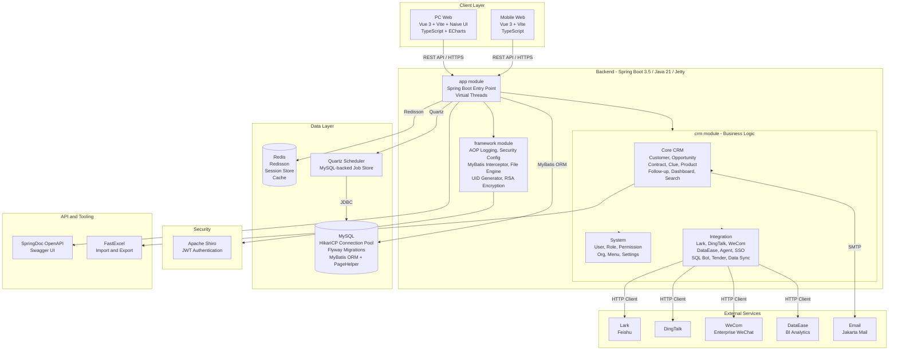

# Architecture Diagram

CordysCRM is a full-stack CRM platform with a Vue 3 frontend and a Spring Boot 3 multi-module backend backed by MySQL and Redis.

## Application Architecture

```mermaid
flowchart TB
    subgraph Clients["Client Layer"]
        WEB["PC Web\nVue 3 + Vite + Naive UI\nTypeScript + ECharts"]
        MOB["Mobile Web\nVue 3 + Vite\nTypeScript"]
    end

    subgraph Backend["Backend - Spring Boot 3.5 / Java 21 / Jetty"]
        subgraph App["app module\nSpring Boot Entry Point\nVirtual Threads"]
        end

        subgraph Framework["framework module\nAOP Logging, Security Config\nMyBatis Interceptor, File Engine\nUID Generator, RSA Encryption"]
        end

        subgraph CRM["crm module - Business Logic"]
            BIZ["Core CRM\nCustomer, Opportunity\nContract, Clue, Product\nFollow-up, Dashboard, Search"]
            SYS["System\nUser, Role, Permission\nOrg, Menu, Settings"]
            INT["Integration\nLark, DingTalk, WeCom\nDataEase, Agent, SSO\nSQL Bot, Tender, Data Sync"]
        end
    end

    subgraph Security["Security"]
        SHIRO["Apache Shiro\nJWT Authentication"]
    end

    subgraph DataLayer["Data Layer"]
        MYSQL[("MySQL\nHikariCP Connection Pool\nFlyway Migrations\nMyBatis ORM + PageHelper")]
        REDIS[("Redis\nRedisson\nSession Store\nCache")]
        QUARTZ["Quartz Scheduler\nMySQL-backed Job Store"]
    end

    subgraph ExternalServices["External Services"]
        LARK["Lark\nFeishu"]
        DING["DingTalk"]
        WECOM["WeCom\nEnterprise WeChat"]
        DATAEASE["DataEase\nBI Analytics"]
        MAIL["Email\nJakarta Mail"]
    end

    subgraph DevOps["API and Tooling"]
        SWAGGER["SpringDoc OpenAPI\nSwagger UI"]
        EXCEL["FastExcel\nImport and Export"]
    end

    WEB -- "REST API / HTTPS" --> App
    MOB -- "REST API / HTTPS" --> App
    App --> Framework
    App --> CRM
    Framework --> Security
    CRM --> BIZ
    CRM --> SYS
    CRM --> INT
    App -- "MyBatis ORM" --> MYSQL
    App -- "Redisson" --> REDIS
    App -- "Quartz" --> QUARTZ
    QUARTZ -- "JDBC" --> MYSQL
    INT -- "HTTP Client" --> LARK
    INT -- "HTTP Client" --> DING
    INT -- "HTTP Client" --> WECOM
    INT -- "HTTP Client" --> DATAEASE
    BIZ -- "SMTP" --> MAIL
    App --> SWAGGER
    BIZ --> EXCEL
```
