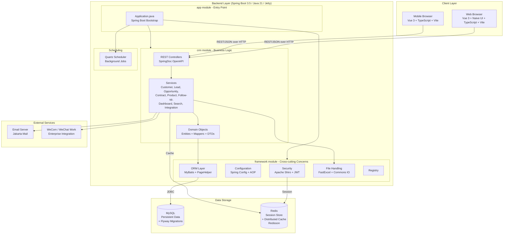

# Architecture Diagram

CordysCRM is a full-stack CRM platform with a Vue 3 web and mobile frontend, a Spring Boot backend, MySQL for persistent storage, and Redis for caching and session management.

## Application Architecture

