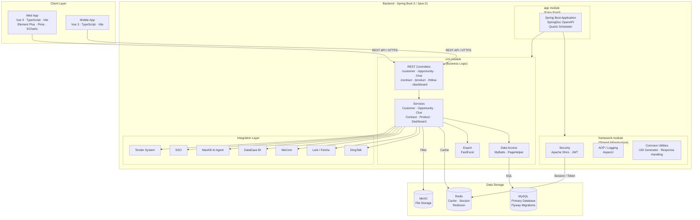

# Architecture Diagram

CordysCRM is a full-stack CRM platform built with a Vue 3 frontend and a Spring Boot 3 multi-module backend, backed by MySQL and Redis, with integrations to external collaboration and BI tools.

## Application Architecture

