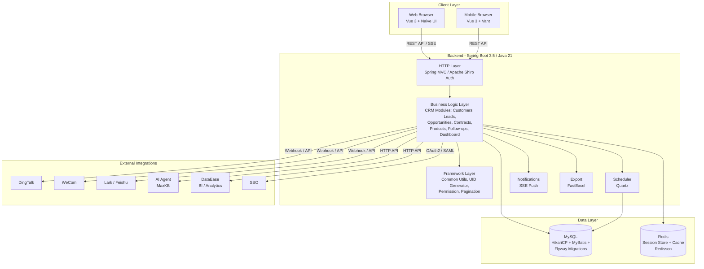

# Architecture Diagram

CordysCRM is a full-stack CRM platform with a Vue 3 web/mobile frontend and a Spring Boot backend, backed by MySQL and Redis, with integrations to enterprise messaging platforms and AI services.

## Application Architecture

