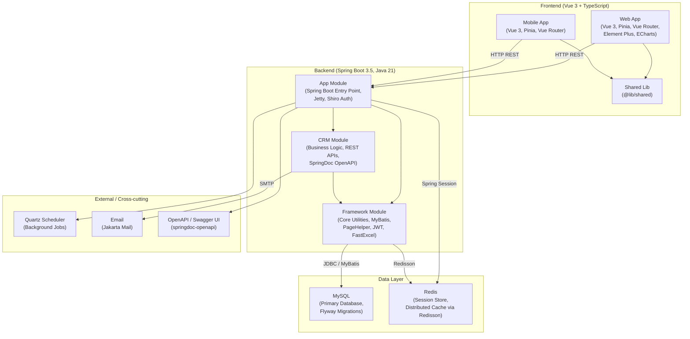

# Architecture Diagram

CordysCRM is a multi-module Java Spring Boot CRM application with a Vue 3 frontend, backed by MySQL, Redis, and scheduled job processing.

## Application Architecture

```mermaid
flowchart TD
    subgraph Frontend["Frontend (Vue 3 + TypeScript)"]
        Web["Web App\n(Vue 3, Pinia, Vue Router,\nElement Plus, ECharts)"]
        Mobile["Mobile App\n(Vue 3, Pinia, Vue Router)"]
        Shared["Shared Lib\n(@lib/shared)"]
    end

    subgraph Backend["Backend (Spring Boot 3.5, Java 21)"]
        App["App Module\n(Spring Boot Entry Point,\nJetty, Shiro Auth)"]
        CRM["CRM Module\n(Business Logic, REST APIs,\nSpringDoc OpenAPI)"]
        Framework["Framework Module\n(Core Utilities, MyBatis,\nPageHelper, JWT, FastExcel)"]
    end

    subgraph DataLayer["Data Layer"]
        MySQL["MySQL\n(Primary Database,\nFlyway Migrations)"]
        Redis["Redis\n(Session Store,\nDistributed Cache via Redisson)"]
    end

    subgraph Integration["External / Cross-cutting"]
        Quartz["Quartz Scheduler\n(Background Jobs)"]
        Mail["Email\n(Jakarta Mail)"]
        OpenAPI["OpenAPI / Swagger UI\n(springdoc-openapi)"]
    end

    Web -- "HTTP REST" --> App
    Mobile -- "HTTP REST" --> App
    Web --> Shared
    Mobile --> Shared
    App --> CRM
    App --> Framework
    CRM --> Framework
    Framework -- "JDBC / MyBatis" --> MySQL
    App -- "Spring Session" --> Redis
    Framework -- "Redisson" --> Redis
    App --> Quartz
    CRM -- "SMTP" --> Mail
    App --> OpenAPI
```
