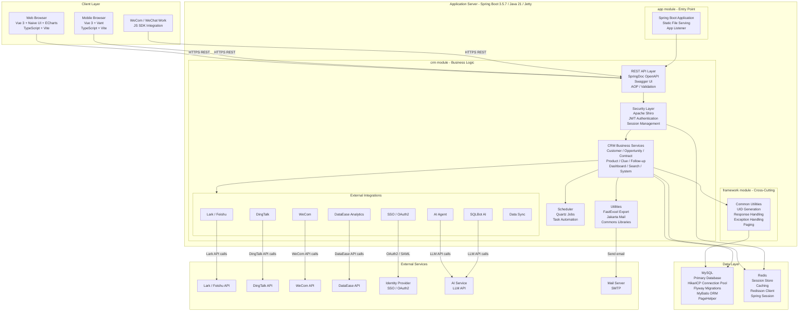

# Architecture Diagram

CordysCRM is a full-stack CRM application built with Spring Boot 3 (Java 21) on the backend and a Vue 3 TypeScript monorepo on the frontend, deployed via Docker.

## Application Architecture

